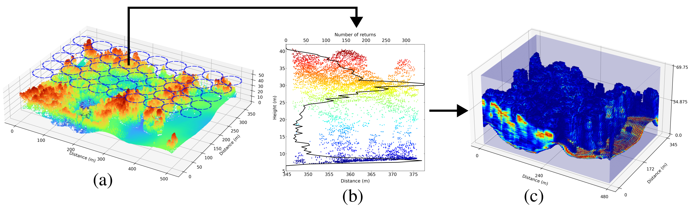

# Hyperheight Data Cube (HHDC) Creator


Pipeline for downloading NEON LiDAR point clouds and generating Hyperheight data cubes used in the **Hyperheight lidar compressive sampling and machine learning reconstruction of forested landscapes** study. 

Author: Andres Ramirez-Jaime.

## Why this exists
- Pulls classified point cloud tiles directly from the [NEON API](https://data.neonscience.org/).
- Tiles the LiDAR extent into Hyperheight cubes ready for compressive sensing and ML experiments.
- Processes one month at a time to stay memory-efficient and to isolate cube outputs by month/site.
- Ships with a sample cube configuration and lightweight CLI for end-to-end runs or per-stage execution.

## Setup
- Python 3.8+ with `requests`, `laspy`, `numpy`, `scipy`, `tqdm` installed.
- Optional: create an isolated environment
  ```bash
  python -m venv .venv
  source .venv/bin/activate
  pip install -U pip
  pip install requests laspy numpy scipy tqdm
  ```

## Quick start: download + build cubes
The orchestrator downloads all available months for a site and builds cubes month-by-month.
```bash
python -m hhdc.main \
  --site SERC \
  --config cube_config_sample.json \
  --download-dir neon_lidar \
  --cube-output-dir cubes \
  --jobs 16 \
  --tiles-per-batch 32
```
Notes:
- `--tiles-per-batch` also applies through the orchestrator: it limits how many tiles share one KD-tree when generating cubes. Higher values (e.g., 32 as shown) use more RAM but rebuild less often (faster). Lower values use less RAM but rebuild more (slower). Set `0` to disable batching and build one tree per month.
Outputs land under `cubes/<SITE>/<month>/` with filenames that include the month suffix, while raw LiDAR stays in `neon_lidar/<SITE>/<month>/`.
If you want to replicate our exact results, you can use the reference cube provided at `SampleCube/gt2.npz`.

Key options:
- `--site` (required) NEON site code (e.g., `ABBY`, `OSBS`, `SERC`).
- `--product` NEON product code (default `DP1.30003.001` discrete return LiDAR).
- `--month` Only process a specific `YYYY-MM`; omit to fetch all available months.
- `--pattern` Filename substring filter (default `*_classified_point_cloud_colorized.laz`).
- `--config` Cube configuration JSON; see `cube_config_sample.json`.
- `--cube-output-dir`, `--cube-prefix`, `--jobs` cube destination and concurrency (applies to reading and cube generation; alias: `--cube-jobs`).

## Run stages independently
```bash
# 1) Download LiDAR tiles
python -m hhdc.download --site SERC --outdir neon_lidar

# 2) Generate cubes for one month to keep memory bounded
python -m hhdc.cube_generator \
  --config cube_config_sample.json \
  --pointcloud-dir neon_lidar/SERC/2021-08 \
  --output-dir cubes/SERC \
  --prefix SERC_2021_08 \
  --jobs 16 \
  --tiles-per-batch 4
```
The cube generator expects `.laz` tiles somewhere under `--pointcloud-dir` and writes `<prefix>_x###_y###.npz` files, each containing the cube tensor, footprint metadata, bin edges, and diagnostic counts.

- `--tiles-per-batch` controls KD-tree batching to bound memory. Higher values group more tiles per tree (faster, more RAM); lower values rebuild more often (slower, less RAM). Use `0` to disable batching and build one tree for the whole extent.
- Example low-memory run: `--tiles-per-batch 4` (as shown above). If you have plenty of RAM, try `--tiles-per-batch 0` for fewer rebuilds.

## Cube configuration
`cube_config_sample.json` documents the generator parameters:
```json
{
  "cube_length": 128,
  "vertical_height": 64.0,
  "vertical_resolution": 0.5,
  "footprint_separation": 2.0,
  "footprint_radius": 2.0
}
```
- `cube_length`: horizontal cube size in meters.
- `vertical_height` and `vertical_resolution`: bin edges for vertical histograms.
- `footprint_separation`: spacing for the 2-D grid of footprints inside each cube.
- `footprint_radius`: KD-tree search radius when assigning points to footprints.
- Note: The end-to-end pipeline has been exercised on a workstation with 128 GB RAM; memory needs will scale with the number and size of tiles you process.

## Repository map
- `hhdc/` – CLI entry points (`main.py`, `download.py`, `cube_generator.py`).
- `cube_config_sample.json` – starter configuration for reproducible cubes.
- `neon_lidar/`, `cubes/` – default download and output roots (created at runtime).
- `experiments.ipynb` – example notebook for analysis and downstream ML experiments.
- `hhdc/canopy_plots.py` – visualization utilities for generated cubes.
- `hhdc/forward_model.py` – lidar forward imaging model that applies Gaussian aggregation, distance-based photon loss, and mixed noise sources for controlled degradation of cubes.

## Forward model (controlled degradation)
`hhdc/forward_model.py` provides a PyTorch implementation of a lidar forward imaging model that degrades high-res cubes in a controlled way:
- Gaussian aggregation over the footprint to blur/spread returns before downsampling.
- Photon loss with distance scaling to simulate reduced signal at higher altitudes.
- Multiple noise sources (Poisson shot noise with additive Gaussian readout noise) to mimic sensor and background noise.

## Citation
If you use this code or derived cubes, please cite:
```
@article{ramirez2024hyperheight,
  title={Hyperheight lidar compressive sampling and machine learning reconstruction of forested landscapes},
  author={Ramirez-Jaime, Andres and Pena-Pena, Karelia and Arce, Gonzalo R and Harding, David and Stephen, Mark and MacKinnon, James},
  journal={IEEE Transactions on Geoscience and Remote Sensing},
  volume={62},
  pages={1--16},
  year={2024},
  publisher={IEEE}
}
```

Questions or issues: feel free to open an issue or reach out to Andres Ramirez-Jaime at aramjai@udel.edu.
